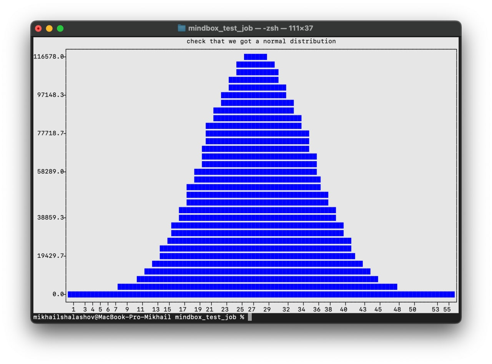

# Mindbox - test job

Answer to the test assignment for the data science intern position

### Задание: 

Нашей компании нужно сгруппировать клиентов для АБ-тестов. Алгоритм группировки очень простой - взять ID клиента (состоит из 5-7 цифр, например 7412567) и найти сумму всех его цифр. Получившееся число и является номером группы, в которую входит данный клиент.

Для того, чтобы понять, насколько хорош такой простой алгоритм, тебе нужно написать следующие диагностические функции:

Функция, которая подсчитывает число покупателей, попадающих в каждую группу, если нумерация ID сквозная и начинается с 0. На вход функция получает целое число n_customers (количество клиентов).
Функция, аналогичная первой, если ID начинается с произвольного числа. На вход функция получает целые числа: n_customers (количество клиентов) и n_first_id (первый ID в последовательности).
Напишите код функций на Python и оформите его в репозиторий Github. В форму ответа вставьте ссылку на репозиторий, убедитесь, что он публичный. 

Дополнительно к работоспособности оценим:

читабельность и аккуратность кода;
производительность кода.

### Ответ

Функция для подсчета количества клиентов в группах АБ теста: 
count_customers(n_customers: int, n_first_id: int = 0) 
Параметр по умолчанию n_first_id равен 0. В задании указано, что необходимо две функции, но т.к. у них одинаковый функционал (за исключение n_first_id) данный функционал можно реализовать в рамках одной функции, если вынести n_first_id в параметр. 

Воспомогательные функции:
1. generate_random_number() - получаем случайное число заданной длины
2. visualize_abtest_group_distribution() - проверяем, что получили нормальное распределение

